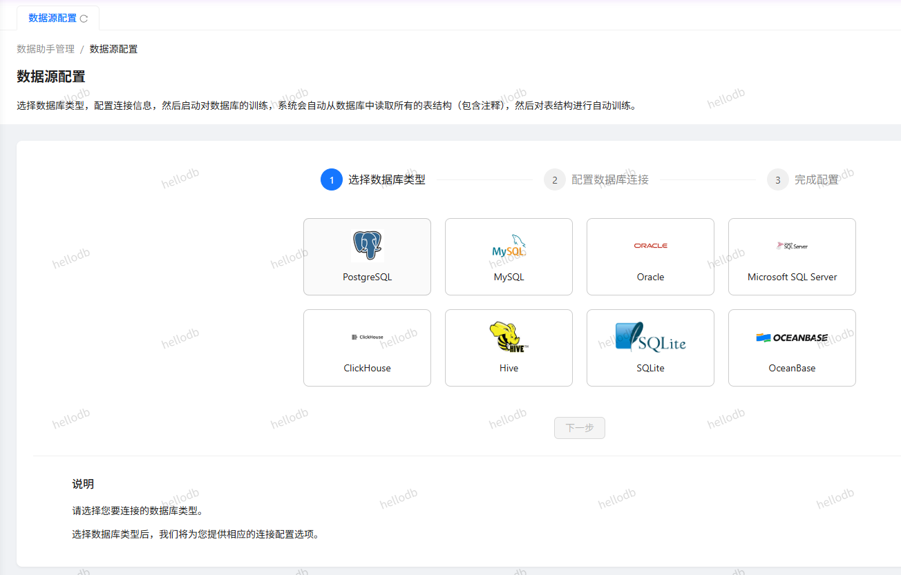

## hellodb

**Author:** cdnxy  
**Version:** 0.0.7  
**Type:** tool

### Introduction

HelloDB - Making Intelligent Database Conversations Within Reach  
HelloDB is an intelligent database conversation platform. With just a few simple steps, your database can have natural language interaction capabilities and quickly connect to the Dify platform. No need to write complex SQL statements—everyone can easily gain data insights.

#### Core Features
Comprehensive Database Support  
Supports mainstream database systems: MySQL, PostgreSQL, SQL Server, Oracle, ClickHouse, Hive, SQLite, etc.  
Simple and intuitive connection configuration—just fill in the basic connection information to complete the setup.  
Intelligently adapts to various database structures, with no additional development work required.

#### Dify Application
Plugin Authorization:
! [HelloDB Plugin Authorization] (./_ passes/dify plugin auth. png)
Configure HelloDB in Workflow
! [Use of HelloDB Plugin in Workflow] (./_ passes/dify workflow. png)

#### Four Steps to Build an Intelligent Data Application
Add Data Source Connection: Fill in basic connection information, supporting secure read-only permission configuration.  
Create Data Application: Create dedicated applications for different business scenarios, customize names and access aliases.  
Start Data Training: One-click to start automatic training; the system automatically analyzes data structures and relationships.  
Experience Intelligent Conversation: Ask questions directly in natural language to get accurate data answers and visual charts.

#### Diverse Training Modes
Automatic Exploration: The system automatically analyzes database table structures, field relationships, and data characteristics.  
SQL Sample Training: Add common SQL query samples to improve query accuracy in specific scenarios.  
Document Enhancement: Supports adding business documents to help the system better understand enterprise-specific terms and business rules.  
Training Data Management: Convenient interface for managing training data—add, edit, and delete training data at any time.

#### Flexible Integration and Expansion
Open API Interface: Provides standard REST APIs for easy integration into existing systems and applications.  
Third-Party Platform Integration: Supports integration with Dify, MCP, and other services to build more complex intelligent applications.  
Custom Initial Prompts: Set exclusive prompts for each application to guide more accurate conversation experiences.  
Multi-Application Management: Manage multiple data applications on the same platform to meet different business needs.

#### Security and Privacy Protection
Supports On-Premises Deployment: Data stays within the enterprise intranet to ensure sensitive information security.  
Read-Only Permission Design: It is recommended to use a dedicated account with only query permissions to ensure database security.  
Application Key Management: Independent application key system to ensure secure and controllable API access.

#### Application Scenarios
Business Analysts: No need to learn SQL, directly use natural language to obtain business data and insights.  
Database Administrators: Quickly build a self-service database query platform to reduce daily query workload.  
Enterprise Decision Makers: Access key business metrics anytime, anywhere through conversation to assist decision-making.  
Development Teams: Integrate intelligent database query capabilities into existing applications to enhance user experience.  
HelloDB makes database interaction simple and natural, unleashes data value, and helps enterprises with digital transformation. Experience it now and let your database speak!

#### FAQ

**Which databases are supported?**  
Currently, mainstream databases such as MySQL, PostgreSQL, MSSQL, Oracle, ClickHouse, and Hive are supported.

**Why did my database connection fail?**  
Please ensure that the database user has query permissions for all databases. Also, make sure the following IP is allowed by your database: 47.115.22.223

**Is my data safe?**  
Yes, it is safe. For enhanced security, we recommend:

1. Deploying HelloDB privately;
2. Creating a dedicated account for HelloDB database access with only query permissions.

**What training modes are supported?**  
First, after configuring the data source, HelloDB can directly explore the database without any additional operations from you.  
Second, to enhance query performance, you can add some SQL samples.  
Additionally, to make the results more tailored to your enterprise, you can add some documents to provide more detailed data descriptions or to supplement the environment with more specific information.