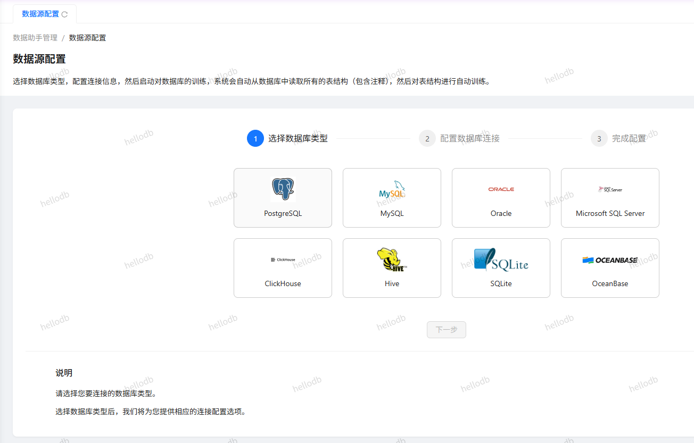
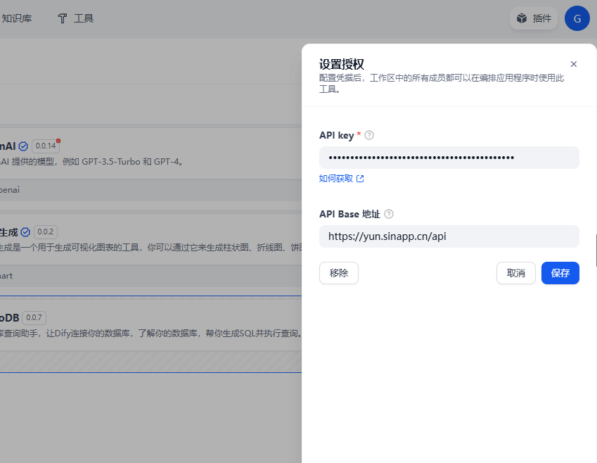
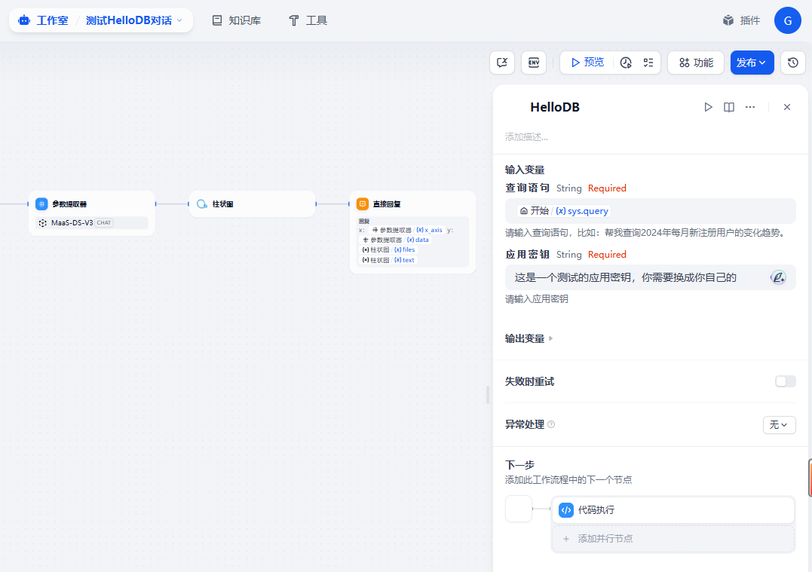

## hellodb

**Author:** cdnxy
**Version:** 0.0.7
**Type:** tool

### 介绍

HelloDB - 让数据库智能对话触手可及
HelloDB 是一款数据库智能对话平台，只需简单几步，即可让您的数据库拥有自然语言交互能力，快速接入Dify平台，无需编写复杂的 SQL 语句，人人都能轻松获取数据洞察。

#### 核心功能
全面的数据库支持
支持主流数据库系统：MySQL、PostgreSQL、SQL Server、Oracle、ClickHouse、Hive、SQLite等
简单直观的连接配置，只需填写基础连接信息即可完成设置
智能适配各类数据库结构，无需额外开发工作

#### Dify应用
插件授权：

工作流中配置插件

#### 四步打造智能数据应用
添加数据源连接：填写基础连接信息，支持安全的只读权限配置
创建数据应用：为不同业务场景创建专属应用，自定义名称和访问别名
启动数据训练：一键开启自动训练，系统自动分析数据结构和关系
体验智能对话：直接通过自然语言提问，获取精准数据答案和可视化图表

#### 多样化训练模式
自动探索：系统自动分析数据库表结构、字段关系和数据特征
SQL 样例训练：添加常用 SQL 查询样例，提升特定场景下的查询精度
文档增强：支持添加业务文档，使系统更好地理解企业特定术语和业务规则
训练数据管理：便捷的训练数据管理界面，随时添加、编辑和删除训练数据

#### 灵活的集成与扩展
开放 API 接口：提供标准 REST API，轻松集成到现有系统和应用
第三方平台对接：支持与 Dify、MCP 等服务对接，构建更复杂的智能应用
自定义初始提示：为每个应用设置专属提示词，引导更精准的对话体验
多应用管理：在同一平台管理多个数据应用，满足不同业务场景需求

#### 安全与隐私保障
支持私有化部署：数据不出企业内网，确保敏感信息安全
只读权限设计：推荐使用专用账号，仅配置查询权限，保障数据库安全
应用密钥管理：独立的应用密钥体系，确保 API 访问安全可控

#### 应用场景
业务分析师：无需学习 SQL，直接用自然语言获取业务数据和洞察
数据库管理员：快速构建数据库自助查询平台，减轻日常查询负担
企业决策层：随时随地通过对话获取关键业务指标，辅助决策制定
开发团队：将数据库智能查询能力集成到现有应用，提升用户体验
HelloDB 让数据库交互变得简单自然，释放数据价值，助力企业数字化转型。立即体验，让您的数据库会说话！

#### FAQ

**支持哪些数据库？**
目前支持主流的MySQL、PostgreSQL、MSSQL、Oracle、ClickHouse、Hive等数据库。

**我的数据安全吗？**
安全。为了保证更加安全性，我们建议：
①私有化部署；
②数据库连接中添加专用账号，仅用于HelloDB访问数据库，并且只添加查询权限。

**支持哪些训练模式？**
首先，配置数据源后，无须您做任何操作，HelloDB可以直接探索数据库；
其次，为了增强查询效果，您可以添加一些SQL样例；
同时，为了效果更接近您的企业内部，您可以添加一些Document，对数据进行更详细的描述，或者对环境做一些更明确的补充。